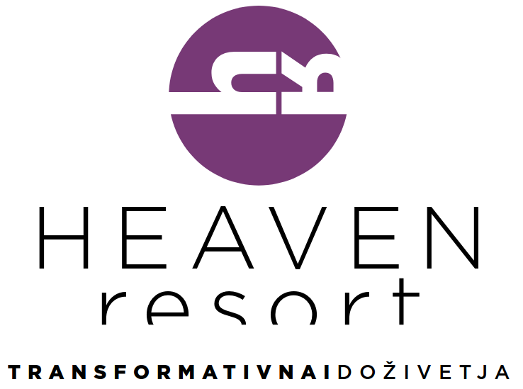

# HEAVEN Resort Website



**TRANSFORMATIVNA IDOŽIVETJA** | Transformative Experiences

An elegant, production-ready website for HEAVEN Resort - a transformative nature retreat and event space located on a hilltop near Šmarje pri Podčetrtku, Slovenia.

## 🌟 Features

- **Modern Tech Stack**: Next.js 14, TypeScript, TailwindCSS
- **Elegant Design**: Brand-aligned purple theme with minimalist aesthetics
- **Multi-language Support**: Slovenian and English
- **Smooth Animations**: Framer Motion for elegant transitions
- **Booking System**: Integrated inquiry and booking forms
- **Responsive Design**: Mobile-first, fully responsive
- **SEO Optimized**: Proper metadata and semantic HTML
- **Gallery**: Beautiful image galleries for showcasing the venue
- **Contact Forms**: React Hook Form with validation
- **Backend Ready**: Supabase integration for data management

## 🎨 Brand Identity

- **Primary Color**: Purple (#7B4B8E)
- **Typography**: Light, spaced lettering - "HEAVEN" in uppercase, "resort" in lowercase
- **Logo**: Circular design with stylized house/shelter icon
- **Tagline**: "TRANSFORMATIVNA IDOŽIVETJA"
- **Vibe**: Elegant, serene, transformative, upscale nature retreat

## 📋 Sections

1. **Hero** - Dramatic full-screen hero with logo and call-to-action
2. **About** - Introduction to HEAVEN Resort and core values
3. **Venue Features** - Indoor accommodation, outdoor camping, event spaces
4. **Events & Experiences** - Weddings, corporate retreats, workshops, private events
5. **Accommodation** - Details about indoor and camping options
6. **Gallery** - Visual showcase of the venue
7. **Packages** - Pricing packages for different event types
8. **Contact** - Inquiry form with contact information and map

## 🚀 Getting Started

### Prerequisites

- Node.js 18+ 
- npm or yarn
- Supabase account (optional, for backend functionality)

### Installation

1. **Clone or navigate to the project directory**:
   ```bash
   cd /home/jack/CascadeProjects/heaven-resort
   ```

2. **Install dependencies** (already done):
   ```bash
   npm install
   ```

3. **Set up environment variables**:
   ```bash
   cp .env.local.example .env.local
   ```
   
   Then edit `.env.local` with your credentials:
   ```env
   NEXT_PUBLIC_SUPABASE_URL=your_supabase_url
   NEXT_PUBLIC_SUPABASE_ANON_KEY=your_supabase_anon_key
   ```

4. **Run the development server**:
   ```bash
   npm run dev
   ```

5. **Open your browser**:
   Navigate to [http://localhost:3000](http://localhost:3000)

## 🗄️ Supabase Setup (Optional)

If you want to enable the booking system, set up Supabase:

### 1. Create Supabase Project

Go to [supabase.com](https://supabase.com) and create a new project.

### 2. Create Database Tables

Run these SQL commands in the Supabase SQL Editor:

```sql
-- Bookings table
CREATE TABLE bookings (
  id UUID DEFAULT gen_random_uuid() PRIMARY KEY,
  created_at TIMESTAMP WITH TIME ZONE DEFAULT TIMEZONE('utc'::text, NOW()) NOT NULL,
  name TEXT NOT NULL,
  email TEXT NOT NULL,
  phone TEXT,
  event_type TEXT,
  event_date DATE,
  guests INTEGER,
  message TEXT NOT NULL,
  status TEXT DEFAULT 'pending' CHECK (status IN ('pending', 'confirmed', 'cancelled'))
);

-- Contact messages table
CREATE TABLE contact_messages (
  id UUID DEFAULT gen_random_uuid() PRIMARY KEY,
  created_at TIMESTAMP WITH TIME ZONE DEFAULT TIMEZONE('utc'::text, NOW()) NOT NULL,
  name TEXT NOT NULL,
  email TEXT NOT NULL,
  phone TEXT,
  message TEXT NOT NULL,
  status TEXT DEFAULT 'new' CHECK (status IN ('new', 'read', 'replied'))
);

-- Enable Row Level Security
ALTER TABLE bookings ENABLE ROW LEVEL SECURITY;
ALTER TABLE contact_messages ENABLE ROW LEVEL SECURITY;

-- Create policies for public insert
CREATE POLICY "Allow public insert" ON bookings
  FOR INSERT TO anon
  WITH CHECK (true);

CREATE POLICY "Allow public insert" ON contact_messages
  FOR INSERT TO anon
  WITH CHECK (true);
```

### 3. Get API Keys

1. Go to Project Settings > API
2. Copy the `URL` and `anon public` key
3. Add them to your `.env.local` file

## 📁 Project Structure

```
heaven-resort/
├── app/
│   ├── globals.css          # Global styles with Tailwind
│   ├── layout.tsx           # Root layout with header/footer
│   └── page.tsx             # Home page with all sections
├── components/
│   ├── layout/
│   │   ├── Header.tsx       # Navigation header with logo
│   │   └── Footer.tsx       # Footer with links
│   └── sections/
│       ├── Hero.tsx         # Hero section
│       ├── About.tsx        # About section
│       ├── VenueFeatures.tsx
│       ├── Events.tsx
│       ├── Accommodation.tsx
│       ├── Gallery.tsx
│       ├── Packages.tsx
│       └── Contact.tsx      # Contact form
├── contexts/
│   └── LanguageContext.tsx  # Multi-language support
├── lib/
│   ├── supabase.ts          # Supabase client & API
│   ├── translations.ts      # SL/EN translations
│   └── utils.ts             # Utility functions
├── public/
│   └── images/
│       └── logo.png         # HEAVEN Resort logo
└── tailwind.config.ts       # Tailwind configuration
```

## 🎨 Customization

### Colors

Edit `tailwind.config.ts` to change the brand colors:

```typescript
colors: {
  primary: {
    DEFAULT: '#7B4B8E',  // Main purple
    dark: '#5F3A6F',
    light: '#9B6BAE',
  },
}
```

### Translations

Edit `lib/translations.ts` to modify text content in Slovenian and English.

### Images

Replace placeholder images in the Gallery section with actual venue photos. Add images to `public/images/` directory.

## 🌐 Deployment

### Deploy to Vercel (Recommended)

1. Push your code to GitHub
2. Go to [vercel.com](https://vercel.com)
3. Import your repository
4. Add environment variables in Vercel dashboard
5. Deploy!

### Build for Production

```bash
npm run build
npm start
```

## 📝 Content Management

### Update Contact Information

Edit `lib/translations.ts`:

```typescript
contact: {
  info: {
    address: 'Your Address',
    email: 'your@email.com',
    phone: '+386 XX XXX XXX',
  },
}
```

### Update Packages & Pricing

Edit the `packages` section in `lib/translations.ts` to modify pricing and features.

### Add Gallery Images

1. Add images to `public/images/gallery/`
2. Update the Gallery component to reference your images

## 🔧 Development

### Available Scripts

- `npm run dev` - Start development server
- `npm run build` - Build for production
- `npm start` - Start production server
- `npm run lint` - Run ESLint

### Tech Stack Details

- **Framework**: Next.js 14 with App Router
- **Language**: TypeScript
- **Styling**: TailwindCSS
- **Animations**: Framer Motion
- **Forms**: React Hook Form
- **Icons**: Lucide React
- **Backend**: Supabase (PostgreSQL)
- **Deployment**: Vercel-ready

## 📱 Responsive Breakpoints

- Mobile: < 640px
- Tablet: 640px - 1024px
- Desktop: > 1024px

## 🎯 Key Features Implementation

### Multi-language Toggle
Click the globe icon in the header to switch between Slovenian and English.

### Smooth Scrolling
Navigation links smoothly scroll to sections with animated transitions.

### Contact Form Validation
Forms use React Hook Form with built-in validation and error messages.

### Booking System
Integrated with Supabase for storing inquiries and managing bookings.

## 🐛 Troubleshooting

### Images not loading
- Ensure images are in `public/images/` directory
- Check file paths are correct
- Restart dev server after adding new images

### Supabase errors
- Verify environment variables are set correctly
- Check Supabase project is active
- Ensure RLS policies are configured

### Build errors
- Run `npm install` to ensure all dependencies are installed
- Check for TypeScript errors with `npm run lint`
- Clear `.next` folder and rebuild

## 📄 License

This project is proprietary and confidential for HEAVEN Resort.

## 📞 Support

For questions or support, contact the development team or HEAVEN Resort directly.

---

**Built with ❤️ for HEAVEN Resort**

*Transformativna Idoživetja - Creating unforgettable experiences in nature*
